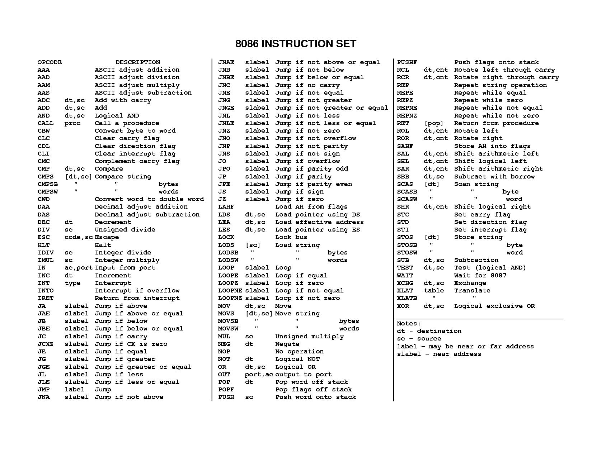

# Machine Level

## Machine Code

Machine code is generated by a compiler based on programming language rules and the instruction set of the target machine.

GCC compiler, compiles C into assembly code then invokes `assembler` and `linker` to generate machine code.

32-bit machine can only take advantage of 4GB (2^32 bytes) of RAM
64-bit machine can use upto 256 Terabytes (2^48) of RAM

Moores Law: The number of transistors on a microprocessor doubles every 26 months.

```c
#include <stdio.h>

int main(void)
{
    printf("hello, world\n");
}
```
How will gcc turn this into machine code?
1. C preprocessor will load stdio.h
2. C compiler generates assembly code
3. Assembler converts assembly code into binary
4. Linker merges our binary with the stdio binary and generates final executable

Program Counter or PC: address in memory of the next instruction to be executed.
Integer Register File: 8 32-bit values hold addresses or integer data.
Condition Code Registers: used for conditional changes in control flow (`if`, `while`).
Floating Point Registers: store floating point data.

How to see the assembly?
`gcc file.c -S`

How to see the object code?
`gcc file.c -c` This will compile and assemble.

## Instruction Sets

Each microprocessor will have a single instruction set. Here is one of the most simple (8086):



### Condition Codes
In addtion to the registers, the CPU stores a bunch of flags. Some of those include:
CF: Carry Flag. The most recent operation generated a carry out of the most
significant bit. Used to detect overflow for unsigned operations.
ZF: Zero Flag. The most recent operation yielded zero.
SF: Sign Flag. The most recent operation yielded a negative value.
OF: OverFlow Flag. The most recent operation caused a twos complement overflow operation.

## Math
Common Arithmetic and Logical Operations:
`inc` D + 1 Increment
`dec` D - 1 Decrement
`neg` -D Negate
`not` ~D Complement
`add` D + S Add
`sub` D - S Subtract
`imul` D * S Multiply
`xor` D ^ S Exclusive-or
`or` D | S Or
`and` D & S And

## Control
Common Control Operations:
`cmpb` Compare byte
`cmpw` Compare word
`cmpl` Compare double word
`testb` Test byte
`testw` Test word
`testl` Test double word

## Set Things
`sete` D←ZF Equal / zero
`setne` D←~ZF Not equal / not zero

## Jumps
`jmp` Label 1 Direct jump
`jmp` *Operand 1 Indirect jump
`je` Label jz ZF Equal / zero
`jne` Label jnz ~ZF Not equal / not zero

## Moves
`movb` Move byte
`movw` Move word
`movl` Move double word
`pushl` Push double word
`popl` Pop double word
`cmove` ZF Equal / zero
`cmovne` ~ZF Not equal / not zero

## Loops
Most compilers write loops using the do-while form even tho it is one of the less common of the control structures when writing code.

In c you might write a do-while loop like this:

```c
int i = 0;
do
  printf("hello, world\n");
while(i++ < 3);
```

compilers will use the tags and go-to statements like this:
```
loop_tag:
   //body
   if(condition)
      goto loop_tag;
```

A Historical Perspective 156
3.2 Program Encodings 159
3.3 Data Formats 167
3.4 Accessing Information 168
3.5 Arithmetic and Logical Operations 177
3.6 Control 185
3.7 Procedures 219
3.8 Array Allocation and Access 232
3.9 Heterogeneous Data Structures 241
3.10 Putting It Together: Understanding Pointers 252
3.11 Life in the Real World: Using the gdb Debugger 254
3.12 Out-of-Bounds Memory References and Buffer Overflow 256
3.13 x86-64: Extending IA32 to 64 Bits 267
3.14 Machine-Level Representations of Floating-Point Programs 292
3.15 Summary 293
Bibliographic Notes 294
Homework Problems 294
Solutions to Practice Problems 308